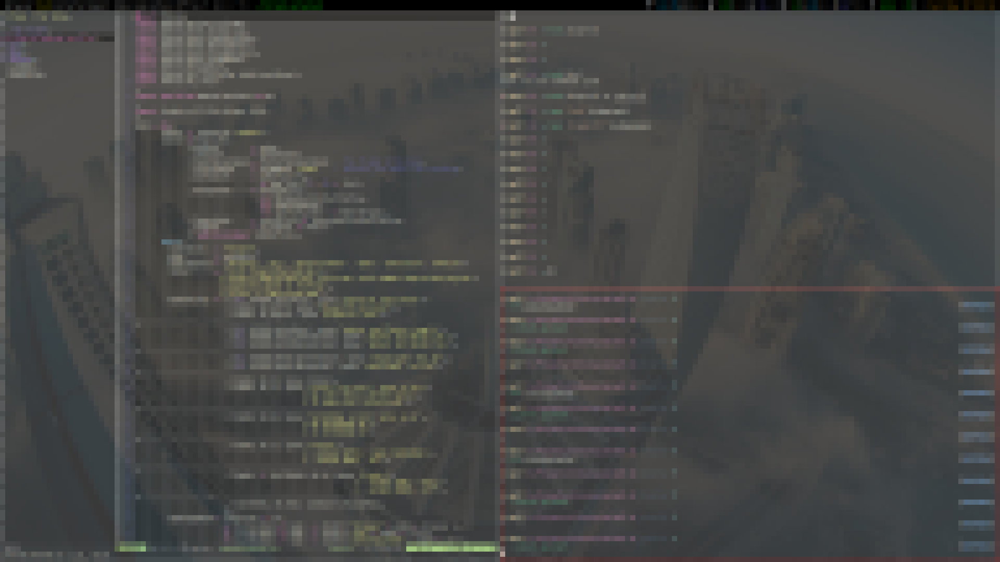

i3lock-pixeled
==============

Simple i3lock helper which pixels a screenshot by scaling it down and up to get a pixeled version
of the screen when the lock is active.



## Install

### Manually

Clone the repository using the following command:

```
wget https://github.com/Ma27/i3lock-pixeled/archive/1.1.0.tar.gz -O i3lock-pixeled-1.1.0.tar.gz
tar -xzvf i3lock-pixeled-1.1.0.tar.gz
cd i3lock-pixeled-1.1.0
```

Install it into `/usr/local/bin`:

```
make install
```

Now the executable is accessible in `/usr/local/bin/i3lock-pixeled`.
However if you'd like to place it in a different directory, you can set the `PREFIX` var:

```
make install PREFIX=/custom/install/target
```

### Nix

When using the `nix` package manager you can run `nix-env -f default.nix -i` to install the `i3lock-pixeled` derivation into your local profile.

For development processes you can run `nix-shell` to open an isolated shell which contains all build dependencies of `i3lock-pixeled`.

## Uninstall

The `Makefile` contains an `uninstall` recipe as well which removes the `i3lock-pixeled` executablefrom the given prefix.

## License

The project is bundled with the `MIT` license. Please refer to the [`LICENSE`](https://github.com/Ma27/i3lock-pixeled/blob/master/LICENSE) file that was distributed with the source code.
